# Transport Control Tower Lab

[](https://www.python.org/)
[](https://streamlit.io/)
[](LICENSE)
[](#roadmap--coming-soon)

Open-source Python CLI for practical logistics control-tower automation.

The goal is not to replace a TMS. The goal is to turn messy operational files into clean events, explainable exceptions, and useful review packs that transport teams can act on.

## v1.0.0 Factory Release

The v1.0.0 release closes the 13-product local-first factory. It packages the completed transport control-tower lab as a file-based toolkit for demos, learning, and practical operational review without paid APIs, authentication, databases, messaging integrations, BI servers, or live production connectors.

Included products:

- Trip Sheet Doctor
- GeoReplay
- ETA Watch
- DetentionClock
- GateTruth
- FuelGuard
- UpdatePulse
- DelayLens
- PODPulse
- LaneLab
- BanWindow
- CarrierScore
- TowerBrief

See [docs/v1.0.0-factory-release.md](docs/v1.0.0-factory-release.md) for the closeout scope and validation checklist.

## Problem

Transport operations teams lose hours every day checking Excel sheets, GPS exports, trip files, and planned stops by hand.

Typical control-tower pain:

- Stop manually checking Excel sheets to see if trucks missed their stops.
- Stop scanning raw GPS dots to understand when a vehicle entered or left a site.
- Stop waiting for analysts to clean trip sheets before managers can see exceptions.
- Stop treating messy source files as if they were clean operational truth.

When the data is messy, late, duplicated, or spread across systems, managers miss the real questions: which truck needs attention, what exception happened, and who should act next.

## Solution

Transport Control Tower Lab is an open-source toolkit for turning messy transport files into manager-ready exception packs.

It gives logistics teams practical local-first tools that:

- clean and normalize messy trip sheets;
- reconstruct geofence visits from GPS pings;
- calculate dwell time, missed stops, and unexpected visits;
- export reviewable CSV/Excel outputs;
- preserve raw inputs and explain the evidence behind each exception.

This repo is built for operations managers, control-tower teams, dispatchers, and fleet teams who need faster exception visibility before investing in heavier integrations.

## Day 1 Micro-Product: Trip Sheet Doctor

Trip Sheet Doctor diagnoses messy Excel/CSV trip sheets and creates an exception workbook for operations review.

It is built as the first micro-tool inside the shared Control Tower CLI.

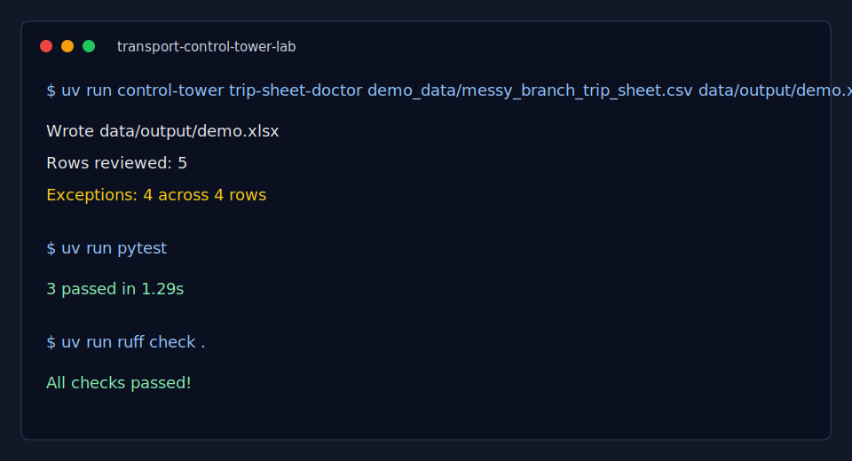

### Who It Is For

- Control tower teams
- Dispatch teams
- Fleet operations managers
- Transport managers
- Anyone cleaning trip sheets before reporting, SLA checks, or GPS/fuel reconciliation

### What It Checks

- Missing trip IDs
- Missing vehicle or door numbers
- Missing origin/destination
- Missing pickup or delivery timestamps
- Delivery time earlier than pickup time
- Duplicate trip IDs
- Same origin and destination
- Very long planned trip duration

### Output Workbook

- `summary`: row count, exception count, exception rate, and exception mix
- `exceptions`: explainable exception cases with severity, evidence, owner, action, and review status
- `correction_suggestions`: source columns and mapping gaps to review
- `cleaned_trips`: normalized trip rows with source row numbers preserved
- `column_map`: source-to-canonical field mapping used by the run

## Day 2 Micro-Product: GeoReplay

GeoReplay is a local-first Streamlit app that reconstructs operational geofence visit events from GPS pings.

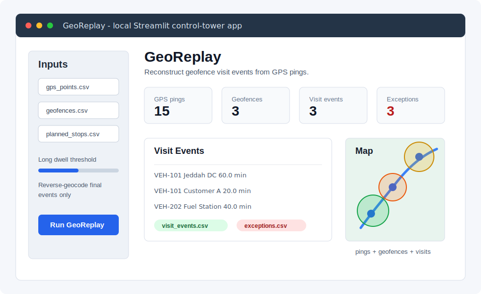

### Who It Is For

- Control tower teams
- Dispatch teams
- Fleet operations managers
- Transport managers
- Anyone checking whether vehicles entered planned depots, hubs, customer sites, or fuel stations

### Problem

Raw GPS pings are hard to review directly. A manager usually needs the event layer:

- Did the vehicle enter the site?
- When did it enter and exit?
- How long did it dwell?
- Which planned stops were missed?
- Which geofence visits were unexpected?

### Inputs

- `gps_points.csv`: `vehicle_id`, `timestamp`, `lat`, `lon`, optional `speed_kph`
- `geofences.csv`: `geofence_id`, `name`, `lat`, `lon`, `radius_m`, optional `geofence_type`
- `planned_stops.csv`: optional plan with `vehicle_id`, `geofence_id`, optional `planned_arrival`, `stop_sequence`

### Outputs

- `georeplay/output/visit_events.csv`
- `georeplay/output/exceptions.csv`
- Interactive Folium map inside Streamlit

### Run GeoReplay

```bash
uv sync
cd georeplay
uv run streamlit run app.py
```

The app loads synthetic demo data from `georeplay/demo_data/` when no files are uploaded.

### GeoReplay Limitations

- V1 supports circular geofences from latitude, longitude, and radius.
- It is local-first and file-based; no live GPS integrations are included.
- Sparse GPS data can understate dwell or miss short visits.
- Reverse geocoding is optional and only applies to geofence master rows, final visit events, and final exception locations. Raw GPS pings are never reverse-geocoded.

## Day 3 Micro-Product: ETA Watch

ETA Watch is a local-first Streamlit app that turns cleaned trip rows and GeoReplay visit events into a manager-ready ETA risk board.

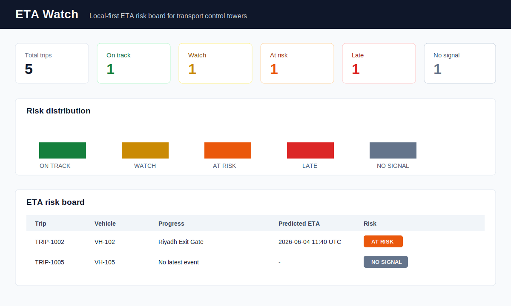

### Who It Is For

- Control tower teams
- Dispatch teams
- Fleet operations managers
- Transport managers
- Customer-service escalation owners
- Anyone manually checking whether trucks are likely to miss promised arrival

### Problem

After trip sheets are cleaned and GPS pings become visit events, control towers still spend time manually checking:

- Which trucks have gone silent?
- Which trips are still safe?
- Which trips need a dispatcher call?
- Which trips are already late?
- Which customer updates need to be prepared first?

### Inputs

- `trips.csv`: `trip_id`, `vehicle_id`, `origin`, `destination`, optional `lane_id`, optional `planned_departure`, `promised_arrival`
- `visit_events.csv`: GeoReplay output with latest geofence visit events
- `lane_baselines.csv`: optional lane/geofence remaining-time baselines

### Outputs

- `eta_watch/output/eta_risk_board.csv`
- `eta_watch/output/late_trips.csv`
- KPI cards, Plotly risk chart, color-coded risk board, and trip detail view inside Streamlit

### Run ETA Watch

```bash
uv sync
uv run streamlit run eta_watch/app.py
```

The app loads synthetic demo data from `eta_watch/demo_data/` when no files are uploaded.

### ETA Watch Limitations

- V1 is deterministic and file-based; no live tracking API is included.
- All timestamps are standardized to UTC before ETA math.
- Baseline quality directly affects predicted ETA quality.
- `NO SIGNAL` means no matching GeoReplay event was available for the vehicle.
- No traffic API, route optimization, SMS/email alerting, driver app, enterprise login, or database backend is included.

## Day 4 Micro-Product: DetentionClock

DetentionClock is a local-first Streamlit app that turns GeoReplay visit events and user-supplied detention rules into a chargeable detention report.

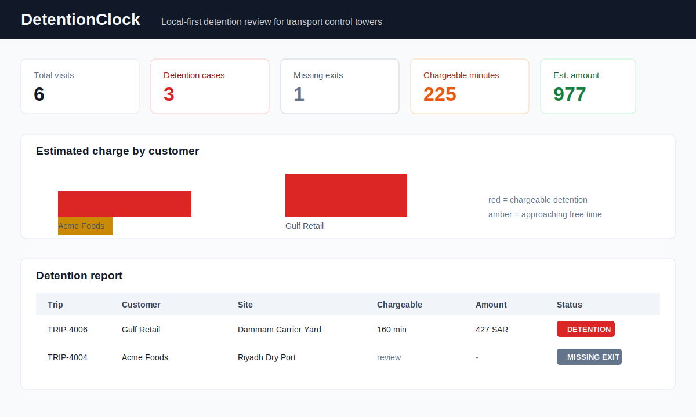

### Who It Is For

- Control tower teams
- Dispatch teams
- Fleet operations managers
- Transport managers
- Billing and customer-service teams reviewing detention claims

### Problem

After site visits are reconstructed, control towers still need to answer billing-sensitive questions:

- Which visits exceeded free time?
- Which visits are close to free-time expiry?
- Which visits are missing exit evidence?
- How many chargeable minutes should be reviewed?
- Which detention cases need customer or carrier evidence before billing?

### Inputs

- `visit_events.csv`: GeoReplay output with `trip_id`, `vehicle_id`, `geofence_id`, `geofence_name`, `geofence_type`, `enter_time`, `exit_time`, `dwell_minutes`
- `detention_rules.csv`: user-supplied free-time and rate rules
- `trips.csv`: optional customer, carrier, origin, destination, and plan context

### Outputs

- `detention_clock/output/detention_report.csv`
- `detention_clock/output/chargeable_detention.csv`
- KPI cards, Plotly detention charge chart, detention table, chargeable-only table, and download buttons inside Streamlit

### Run DetentionClock

```bash
uv sync
uv run streamlit run detention_clock/app.py
```

The app loads realistic GCC synthetic demo data from `detention_clock/demo_data/` when no files are uploaded.

### DetentionClock Limitations

- V1 is deterministic and file-based; no billing system integration is included.
- Detention rules must be supplied by the user; no contract terms are hardcoded.
- Missing exits are flagged for evidence review and are not charged automatically.
- Estimated charges are operational estimates, not final invoices.

## Day 5 Micro-Product: GateTruth

GateTruth is a local-first Streamlit app that turns trip plans and GeoReplay visit events into origin and destination gate evidence.

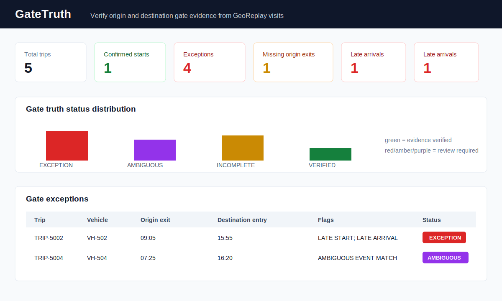

### Who It Is For

- Control tower teams
- Dispatch teams
- Fleet operations managers
- Transport managers
- Customer-service escalation teams checking actual start and arrival truth

### Problem

TMS timestamps and operational reality often drift apart. Control towers still need to answer:

- Did the truck actually enter and exit the origin hub?
- Did the truck actually enter the destination customer site?
- Was the origin exit late versus planned departure?
- Was the destination entry late versus promised arrival?
- Are there multiple plausible GeoReplay events that need human review?

### Inputs

- `trips.csv`: `trip_id`, `vehicle_id`, optional `customer_name`, optional `carrier_name`, `origin`, `destination`, optional `origin_geofence_id`, optional `destination_geofence_id`, `planned_departure`, `promised_arrival`
- `visit_events.csv`: GeoReplay output with optional `trip_id`, `vehicle_id`, `geofence_id`, `geofence_name`, `geofence_type`, `enter_time`, `exit_time`, `dwell_minutes`
- `planned_stops.csv`: optional geofence hints by trip and stop sequence

### Outputs

- `gate_truth/output/gate_truth_report.csv` with actual gate timestamps, delay minutes, `gate_truth_status`, `exception_type`, evidence text, and confidence bucket
- `gate_truth/output/gate_exceptions.csv` with exception type, severity, evidence, and suggested action
- KPI cards, Plotly gate-truth-status chart, gate truth table, exceptions-only table, and download buttons inside Streamlit

### Run GateTruth

```bash
uv sync
uv run streamlit run gate_truth/app.py
```

The app loads realistic GCC synthetic demo data from `gate_truth/demo_data/` when no files are uploaded.

### GateTruth Limitations

- V1 is deterministic and file-based; no TMS integration or live GPS polling is included.
- Ambiguous matches are flagged for review instead of silently auto-resolved.
- Late start, late arrival, and early-arrival review thresholds are configurable. Defaults are 15, 15, and 60 minutes.
- No customer notification workflow, route optimization, legal proof engine, enterprise login, or database backend is included.

## Day 6 Micro-Product: FuelGuard

FuelGuard is a local-first Streamlit app that reconciles fuel transactions against GPS points, GeoReplay visit events, fuel-site masters, and optional trip windows.

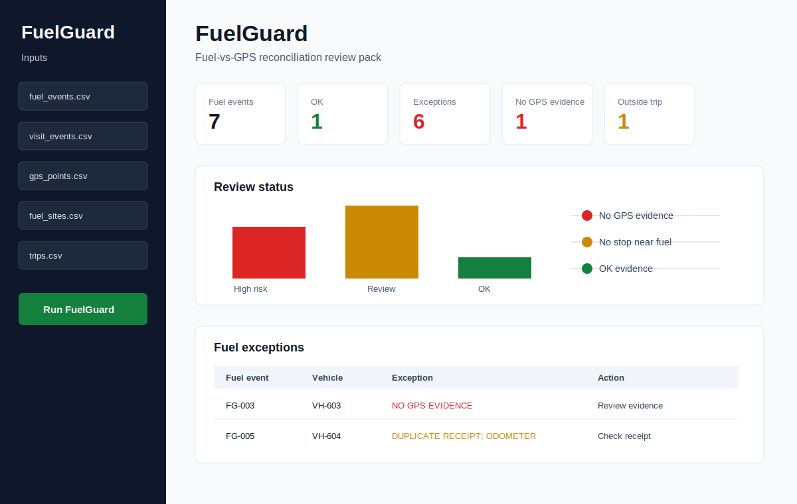

### Who It Is For

- Control tower teams
- Fleet operations managers
- Fuel desk and transport analysts
- Carrier-management teams reviewing fuel-vs-GPS exceptions
- Anyone checking whether a fuel transaction has supporting location and stop evidence

### Problem

Fuel reports alone do not prove that the assigned truck was near the fuel site, stopped long enough, or operating inside the assigned trip window. Managers still need to review:

- Was there nearby GPS evidence at the fuel time?
- Was there a GeoReplay stop with enough dwell?
- Was the fuel event inside the assigned trip window?
- Are receipt numbers duplicated?
- Did odometer readings move backward?
- Is the liters value unusually high for review?

### Inputs

- `fuel_events.csv`: `fuel_event_id`, `vehicle_id`, `fuel_time`, `liters`, optional station, receipt, odometer, amount, driver, carrier, trip, and location fields
- `visit_events.csv`: optional GeoReplay stop evidence with `vehicle_id`, geofence details, enter/exit times, and dwell minutes
- `gps_points.csv`: optional GPS evidence with `vehicle_id`, `timestamp`, `lat`, `lon`, and optional `speed_kph`
- `fuel_sites.csv`: optional known station master with station name, coordinates, and radius
- `trips.csv`: optional trip windows with `trip_id`, `vehicle_id`, `planned_departure`, and `promised_arrival`

### Outputs

- `fuel_guard/output/fuel_reconciliation_report.csv` with fuel event details, matched evidence type, GPS coordinates, station distance, stop evidence, trip-window status, exception flags, risk bucket, severity, evidence text, and suggested action
- `fuel_guard/output/fuel_exceptions.csv` with exception type, severity, evidence, and suggested review action
- KPI cards, Plotly review-status chart, reconciliation table, exceptions-only table, and download buttons inside Streamlit

### Run FuelGuard

```bash
uv sync
uv run streamlit run fuel_guard/app.py
```

The app loads realistic GCC synthetic demo data from `fuel_guard/demo_data/` when no files are uploaded.

### FuelGuard Limitations

- V1 is deterministic and file-based; no fuel card, ERP, payment, or live telematics integration is included.
- Outputs are review flags, not theft accusations or legal claims.
- GPS support depends on uploaded point density and fuel-site coordinate quality.
- Duplicate receipt, odometer, and high-liter checks are first-pass review rules, not final financial conclusions.

## Day 7 Micro-Product: UpdatePulse

UpdatePulse is a local-first Streamlit app that audits TMS and driver update discipline against planned milestones and optional GeoReplay visit evidence.

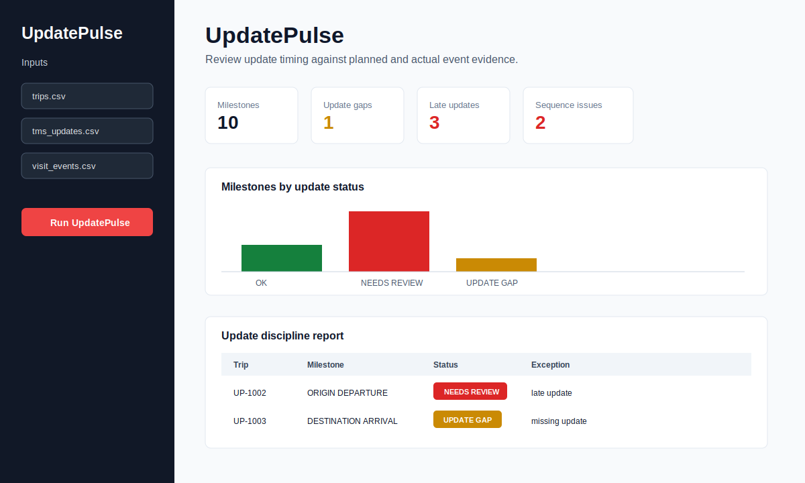

### Who It Is For

- Control tower teams
- Dispatch teams
- Fleet operations managers
- Customer-service escalation teams checking stale or missing trip updates

### Problem

A trip can be physically moving, waiting, delivered, or delayed while the system status remains outdated. Control towers still need to review:

- Which planned departure or arrival milestones have no matching update?
- Which updates were late or unusually early?
- Which trips have duplicate or out-of-sequence updates?
- Which updates lack actual GeoReplay event evidence?
- Which cases need neutral follow-up before customer or manager reporting?

### Inputs

- `trips.csv`: `trip_id`, `vehicle_id`, optional driver, carrier, and customer fields, `origin`, `destination`, `planned_departure`, `promised_arrival`
- `tms_updates.csv` or `driver_updates.csv`: `trip_id`, `update_time`, `status`, optional vehicle, updater, and source fields
- `visit_events.csv`: optional GeoReplay evidence with vehicle, geofence name/type, enter time, exit time, and dwell minutes

### Outputs

- `update_pulse/output/update_discipline_report.csv` with expected status, expected time, matched update time, delay minutes, update gap type, sequence status, evidence status, risk bucket, severity, evidence text, and suggested action
- `update_pulse/output/update_exceptions.csv` with update gaps, late updates, early updates, duplicate updates, sequence issues, and missing actual event evidence
- KPI cards, Plotly status chart, update report table, exceptions-only table, and download buttons inside Streamlit

### Run UpdatePulse

```bash
uv sync
uv run streamlit run update_pulse/app.py
```

The app loads realistic GCC synthetic demo data from `update_pulse/demo_data/` when no files are uploaded.

### UpdatePulse Limitations

- V1 is deterministic and file-based; no TMS, driver app, WhatsApp, or telematics integration is included.
- Status matching expects `ASSIGNED`, `ARRIVED_ORIGIN`, `DEPARTED_ORIGIN`, `ARRIVED_DESTINATION`, `DELIVERED`, and optional `POD_COLLECTED` milestones.
- Sparse visit evidence can create review cases that need dispatcher context.
- Outputs are neutral review flags, not driver punishment or performance penalties.

## Day 8 Micro-Product: DelayLens

DelayLens is a local-first Streamlit app that classifies LTL and linehaul delay causes from trip plans, GeoReplay visit events, and optional lane baselines.

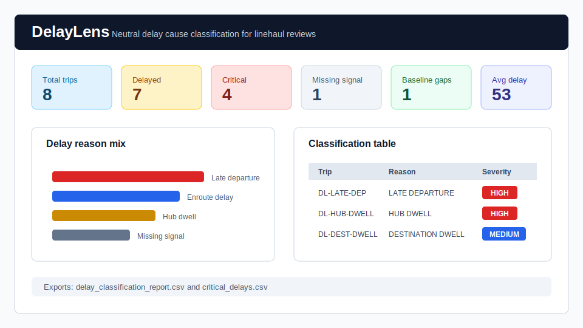

### Who It Is For

- Control tower teams
- Dispatch teams
- Fleet operations managers
- Linehaul planners reviewing late trips
- Customer-service escalation teams needing neutral delay evidence

### Problem

Managers often know a trip is late, but not where time was lost. Control towers still need to separate:

- late origin departure;
- long origin dwell;
- hub or intermediate dwell;
- enroute delay versus lane baseline;
- long destination dwell;
- missing GeoReplay signal;
- missing or weak lane baseline coverage.

### Inputs

- `trips.csv`: `trip_id`, `vehicle_id`, optional customer, carrier, and lane fields, `origin`, `destination`, `planned_departure`, `promised_arrival`
- `visit_events.csv`: GeoReplay evidence with optional `trip_id`, `vehicle_id`, geofence details, enter time, exit time, and dwell minutes
- `lane_baselines.csv`: optional lane baselines with `lane_id`, origin, destination, baseline minutes, percentile columns, and sample size

### Outputs

- `delay_lens/output/delay_classification_report.csv` with actual origin exit, destination entry, delay minutes, dwell minutes, travel minutes, baseline delta, delay reason, secondary flags, severity, evidence, and suggested action
- `delay_lens/output/critical_delays.csv` with critical and high severity delay cases for review
- KPI cards, Plotly delay chart, classification table, critical-only table, and download buttons inside Streamlit

### Run DelayLens

```bash
uv sync
uv run streamlit run delay_lens/app.py
```

The app loads realistic GCC synthetic demo data from `delay_lens/demo_data/` when no files are uploaded.

### DelayLens Limitations

- V1 is deterministic and file-based; no live traffic, route optimization, or telematics API integration is included.
- Delay reasons are evidence-backed classifications, not blame or legal root-cause claims.
- Sparse GeoReplay events can create missing-signal cases that need dispatcher context.
- Baseline mismatch depends on the quality and coverage of uploaded lane baselines.

## Day 9 Micro-Product: PODPulse

PODPulse is a local-first Streamlit app that tracks POD aging and flags delivered trips with missing, late, rejected, approval pending, or invoice-blocking proof of delivery.

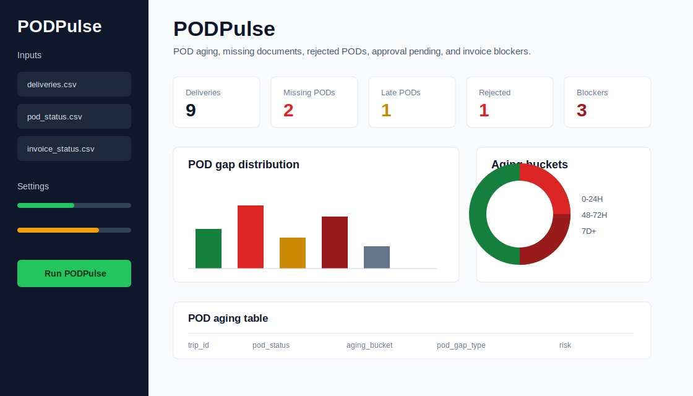

### Who It Is For

- Control tower teams
- Billing teams
- Customer-service teams
- Carrier follow-up owners
- Operations managers reviewing POD gaps before invoicing

### Problem

Delivery is operationally complete only when POD evidence is usable for billing. Teams still need to review:

- missing POD documents;
- POD aging against SLA;
- late POD receipt;
- rejected PODs;
- resubmitted PODs waiting for approval;
- invoice blockers and on-hold cases.

### Inputs

- `deliveries.csv`: `trip_id`, `customer_name`, `delivered_time`, optional vehicle, carrier, origin, destination, and promised arrival fields
- `pod_status.csv`: `trip_id`, `pod_status`, optional received, rejected, approved, resubmitted, uploader, and rejection reason fields
- `invoice_status.csv`: optional invoice status with invoice number, invoice date, and blocked reason

### Outputs

- `pod_pulse/output/pod_aging_report.csv` with delivery context, POD status, invoice status, POD age, aging bucket, POD gap type, invoice blocker flag, risk bucket, severity, evidence, and suggested action
- `pod_pulse/output/overdue_pods.csv` with focused POD gaps and invoice blockers for review
- KPI cards, Plotly charts, POD aging table, overdue POD table, and download buttons inside Streamlit

### Run PODPulse

```bash
uv sync
uv run streamlit run pod_pulse/app.py
```

The app loads realistic GCC synthetic demo data from `pod_pulse/demo_data/` when no files are uploaded.

### PODPulse Limitations

- V1 is deterministic and file-based; no OCR, ERP posting, automated email, or live integration is included.
- POD gap types are neutral review flags, not blame or liability decisions.
- Invoice blocker visibility depends on optional invoice status file quality.
- Missing or invalid delivered time creates a data-quality review case.

## Day 10 Micro-Product: LaneLab

LaneLab is a local-first Streamlit app that builds lane travel-time baselines from historical trips and GeoReplay visit events.

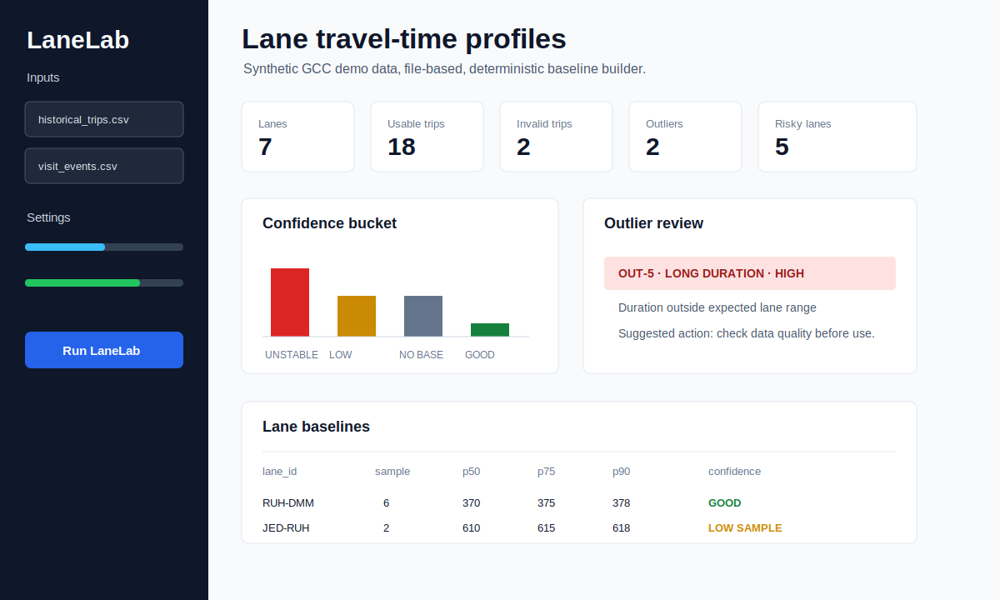

### Who It Is For

- Control tower teams
- ETA and SLA owners
- Transport planners
- Operations analysts
- Fleet managers reviewing lane assumptions

### Problem

ETA and delay workflows need realistic lane baselines. Teams still need to check:

- which lanes have enough historical samples;
- whether a lane is stable enough for ETA review;
- which trips look like outliers;
- which lanes have missing or invalid visit evidence;
- whether current lane assumptions should be refreshed.

### Inputs

- `historical_trips.csv`: `trip_id`, `vehicle_id`, `origin`, `destination`, optional lane, customer, carrier, planned departure, and promised arrival fields
- `historical_visit_events.csv`: GeoReplay-style visits with vehicle, geofence, event type, enter time, exit time, dwell minutes, and optional trip ID

### Outputs

- `lane_lab/output/lane_baselines.csv` with lane context, sample size, usable and invalid counts, p50/p75/p90, average, min, max, standard deviation, outlier count, confidence bucket, evidence, and suggested action
- `lane_lab/output/lane_outliers.csv` with trip-level duration outliers and review evidence
- KPI cards, Plotly confidence chart, baseline table, outlier table, trip-duration table, and download buttons inside Streamlit

Confidence buckets are `GOOD`, `LOW SAMPLE`, `UNSTABLE`, `CHECK DATA`, and `NO BASELINE`.

### Run LaneLab

```bash
uv sync
uv run streamlit run lane_lab/app.py
```

The app loads realistic GCC synthetic demo data from `lane_lab/demo_data/` when no files are uploaded.

### LaneLab Limitations

- V1 is deterministic and file-based; no live traffic API, route optimization, ML prediction, or database backend is included.
- Confidence buckets are data-quality review signals, not operational blame.
- Baselines depend on historical trip coverage and GeoReplay visit-event quality.
- Missing, zero, or negative durations are excluded from percentile calculations and counted as invalid trips.

## Day 11 Micro-Product: BanWindow

BanWindow is a local-first Streamlit app that checks planned or predicted trip movement intervals against user-uploaded restriction windows.

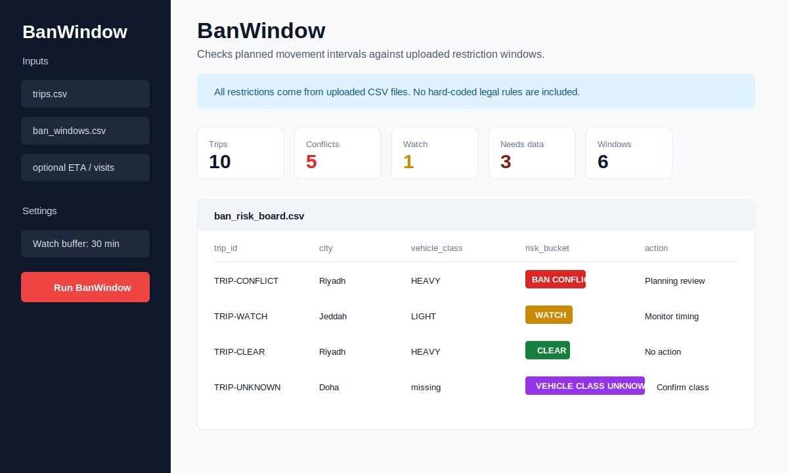

### Who It Is For

- Control tower teams
- Transport planners
- Dispatch teams
- Fleet operations managers
- Customer-service teams preparing delivery commitments

### Problem

Restriction windows can break a trip plan before dispatch or arrival. Teams still need to check:

- which trips overlap uploaded restriction windows;
- which trips are near a window and need a watch flag;
- which rows are missing city or timing evidence;
- which checks depend on unknown vehicle class;
- which conflict rows need planning review.

### Inputs

- `trips.csv`: `trip_id`, `vehicle_id`, `origin`, `destination`, `planned_departure`, `promised_arrival`, optional customer, carrier, city, vehicle class, and planned city window fields
- `ban_windows.csv`: user-supplied restriction windows with `ban_id`, `city`, `start_time`, `end_time`, optional location, vehicle class, days of week, effective dates, and rule notes
- `eta_risk_board.csv`: optional predicted arrival context
- `visit_events.csv`: optional GeoReplay-style visit evidence

### Outputs

- `ban_window/output/ban_risk_board.csv` with trip context, planned and predicted timing, selected movement interval, matched ban-window details, overlap minutes, risk bucket, severity, confidence bucket, evidence, and suggested action
- `ban_window/output/ban_conflicts.csv` with one row per overlapping uploaded restriction window
- KPI cards, Plotly status chart, risk board, conflict table, expanded-window table, and download buttons inside Streamlit

Risk buckets are `CLEAR`, `WATCH`, `BAN CONFLICT`, `MISSING TIMING`, `MISSING CITY`, `VEHICLE CLASS UNKNOWN`, and `DATA MISSING`.

### Run BanWindow

```bash
uv sync
uv run streamlit run ban_window/app.py
```

The app loads realistic GCC synthetic demo data from `ban_window/demo_data/` when no files are uploaded.

### BanWindow Limitations

- V1 is deterministic and file-based; no live legal, permit, traffic, route-optimization, or driver-messaging integration is included.
- BanWindow does not hard-code truck-ban laws, scrape laws, claim legal compliance, or provide legal advice.
- All restriction windows must come from the uploaded `ban_windows.csv` file.
- Missing city, timing, or vehicle-class values reduce the confidence of the planning check.
- Time-of-day restriction windows are expanded against each trip's planned departure date.

## Day 12 Micro-Product: CarrierScore

CarrierScore is a local-first Streamlit app that builds a neutral carrier SLA scorecard from simple trip files and optional exception outputs.

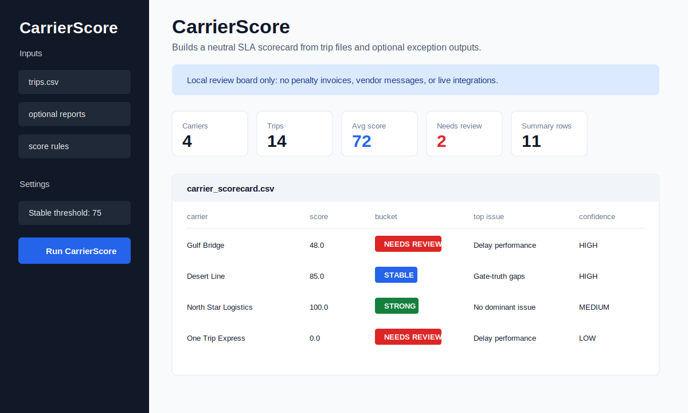

### Who It Is For

- Control tower teams
- Transport managers
- Carrier performance reviewers
- Dispatch and service-quality leads
- Operations teams preparing evidence-based review packs

### Problem

Carrier reviews get messy when performance data is scattered. Teams still need to combine:

- late trips and delay causes;
- missing POD and invoice-blocking document gaps;
- detention exposure;
- update discipline;
- fuel exceptions;
- gate-truth gaps;
- restriction-window risks.

### Inputs

- `trips.csv`: required `trip_id`, `carrier_name`, optional vehicle, customer, lane, origin, destination, planned, promised, and delivered fields
- `delay_classification_report.csv`: optional delay output
- `pod_aging_report.csv`: optional PODPulse output
- `detention_report.csv`: optional DetentionClock output
- `update_discipline_report.csv`: optional UpdatePulse output
- `fuel_exceptions.csv`: optional FuelGuard output
- `gate_truth_report.csv`: optional GateTruth output
- `ban_risk_board.csv`: optional BanWindow output
- `carrier_score_rules.csv`: optional `metric_name`, `weight`, `direction`, `enabled`, `good_threshold`, and `bad_threshold` scoring rules

### Outputs

- `carrier_score/output/carrier_scorecard.csv` with carrier KPIs, exception rates, weighted score, risk bucket, confidence bucket, top issue, evidence, and suggested action
- `carrier_score/output/carrier_exception_summary.csv` with one row per carrier and exception area needing review
- KPI cards, Plotly bucket chart, scorecard table, exception summary, and download buttons inside Streamlit

Risk buckets are `EXCELLENT`, `GOOD`, `WATCH`, `AT RISK`, and `INSUFFICIENT DATA`.

Confidence buckets are `HIGH`, `MEDIUM`, `LOW SAMPLE`, `DATA LIMITED`, and `DATA MISSING`.

### Run CarrierScore

```bash
uv sync
uv run streamlit run carrier_score/app.py
```

The app loads realistic GCC synthetic demo data from `carrier_score/demo_data/` when no files are uploaded.

### CarrierScore Limitations

- V1 is deterministic and file-based; no live carrier, procurement, billing, or messaging integration is included.
- CarrierScore does not create penalty invoices, legal claims, vendor communications, or contract records.
- The trip file remains the primary source of carrier ownership.
- Scores depend on uploaded report quality and user-supplied scoring weights.

## Quick Start

Install dependencies:

```bash
uv sync
```

Run the demo:

```bash
uv run control-tower trip-sheet-doctor \
  data/samples/trip_sheet_doctor_sample.csv \
  data/output/trip_sheet_doctor_demo.xlsx
```

Try the intentionally messy demo files:

```bash
uv run control-tower trip-sheet-doctor \
  demo_data/messy_branch_trip_sheet.csv \
  data/output/messy_branch_trip_sheet.xlsx

uv run control-tower trip-sheet-doctor \
  demo_data/duplicate_and_bad_times.csv \
  data/output/duplicate_and_bad_times.xlsx

uv run control-tower trip-sheet-doctor \
  demo_data/column_mapping_gaps.csv \
  data/output/column_mapping_gaps.xlsx
```

Run tests:

```bash
uv run pytest
```

## CLI Commands

```bash
uv run control-tower init
uv run control-tower clean-tms input.csv data/output/tms_cleaned.xlsx
uv run control-tower clean-gps input.csv data/output/gps_cleaned.xlsx
uv run control-tower trip-sheet-doctor input.csv data/output/trip_sheet_doctor.xlsx
uv run control-tower exceptions input.csv data/output/exceptions.xlsx
uv run control-tower weekly-output data/output/weekly_control_tower_summary.xlsx
uv run control-tower telegram-summary input.csv
```

## Build-In-Public Framework

Each micro-product follows the same lean journey:

1. Problem card
2. Stakeholder
3. Input contract
4. Deterministic rule layer
5. Exception output
6. Demo data
7. Smoke test
8. Public learning note

## Project Shape

```text
src/control_tower_lab/      Python package and CLI
georeplay/                  Product 2 Streamlit app and geospatial engine
eta_watch/                  Product 3 Streamlit app and ETA risk engine
detention_clock/            Product 4 Streamlit app and detention calculation engine
gate_truth/                 Product 5 Streamlit app and gate evidence engine
fuel_guard/                 Product 6 Streamlit app and fuel-vs-GPS reconciliation engine
update_pulse/               Product 7 Streamlit app and update-discipline review engine
data/samples/               Public-safe sample files
demo_data/                  Intentionally messy public demo files
data/input/                 Operator-provided raw files, ignored by git
data/output/                Generated outputs, ignored by git
tests/                      Unit and CLI smoke tests
docs/                       Product notes and build logs
```

## Before / After

### Trip Sheet Doctor

Before:

- Trip sheets arrive with inconsistent column names like `Trip No`, `shipment_no`, `Truck`, `door_number`, `Pickup Time`, and `eta`.
- Required fields may be blank.
- Duplicate trip IDs are easy to miss.
- Delivery time can be earlier than pickup time.
- Same-origin/same-destination rows hide in the sheet.
- Analysts spend review time finding basic data quality issues instead of acting on them.

After:

- The CLI maps common messy source columns into canonical trip fields.
- Each source row is preserved with a `source_row` reference.
- Exceptions are written into a review workbook with severity, evidence, owner, suggested action, and review status.
- The output workbook includes `summary`, `exceptions`, `correction_suggestions`, `cleaned_trips`, and `column_map`.
- Teams get a clear exception pack before ETA, GPS, fuel, SLA, or weekly reporting work begins.

### GeoReplay

Before:

- GPS exports arrive as raw timestamped pings.
- Site masters and planned stops sit in separate files.
- Control tower teams manually inspect dots, filters, and timestamps to understand site visits.
- Missed planned stops, long dwell, and unexpected visits are easy to miss.
- Managers see coordinates instead of an operational event story.

After:

- GeoReplay reconstructs entry, exit, and dwell events from GPS pings and geofence master data.
- Planned stops are compared against detected visits.
- Exceptions are split into missed stops, long dwell, and unexpected visits.
- `visit_events.csv` and `exceptions.csv` are written for review and downstream reporting.
- The Streamlit app shows tables, export buttons, and an interactive Folium map from local files.

### ETA Watch

Before:

- Dispatchers manually compare promised arrival times against the latest event they can find.
- GeoReplay visit events and trip rows sit in separate CSVs.
- Lane knowledge lives in a planner's head or a side spreadsheet.
- Late trips and no-signal trips are discovered too late.
- Managers cannot quickly separate safe trips from watchlist trips.

After:

- ETA Watch joins trips to latest GeoReplay visit events by vehicle.
- Uploaded timestamps are standardized to UTC before ETA calculations.
- Lane baselines estimate remaining minutes when available.
- Each trip is classified as `ON TRACK`, `WATCH`, `AT RISK`, `LATE`, or `NO SIGNAL`.
- The Streamlit app shows KPI cards, a Plotly risk chart, a color-coded table, trip detail, and CSV exports.

### DetentionClock

Before:

- GeoReplay visit events show dwell time, but detention review still happens manually.
- Customer free-time rules live in side spreadsheets.
- Missing exits can accidentally become billing disputes.
- Chargeable minutes are calculated by hand.
- Managers lack a clean split between watchlist dwell and chargeable detention.

After:

- DetentionClock joins visit events to optional trip context and user-supplied rules.
- Each visit is classified as `MISSING EXIT`, `NO DETENTION`, `WITHIN FREE TIME`, `APPROACHING FREE TIME`, or `DETENTION`.
- Chargeable minutes, hours, estimated charges, minimum charges, and currency are calculated deterministically.
- Missing exits are flagged for evidence review before charging.
- The Streamlit app shows KPI cards, a Plotly charge chart, detention tables, and CSV exports.

### GateTruth

Before:

- Trip milestone timestamps in TMS are accepted or challenged manually.
- Origin exit and destination entry evidence is buried inside visit-event exports.
- Dispatchers argue about whether a truck really started or arrived.
- Missing destination visits are discovered late.
- Multiple plausible site events can be collapsed into one story without review.

After:

- GateTruth joins planned trips to GeoReplay visit evidence.
- Each trip gets actual origin entry, origin exit, destination entry, and destination exit timestamps where available.
- Missing origin exits, missing destination entries, late starts, late arrivals, early arrivals, no visit evidence, and ambiguous matches are flagged deterministically.
- `gate_truth_report.csv` and `gate_exceptions.csv` are written for control-tower review.
- The Streamlit app shows KPI cards, a gate-truth-status chart, a full evidence table, and exceptions-only exports.

### FuelGuard

Before:

- Fuel transactions are reviewed separately from GPS points and GeoReplay visits.
- A receipt can exist without proving the vehicle was near the fuel site.
- Short pass-bys can look like valid stops when dwell evidence is not checked.
- Duplicate receipt numbers, odometer sequence issues, and high-liter fills are found manually.
- Fuel events outside the assigned trip window can slip into normal reporting.

After:

- FuelGuard matches each fuel event to nearby GPS and GeoReplay stop evidence.
- Known fuel sites can supply coordinates when the transaction file lacks latitude and longitude.
- Each row is classified as `OK`, `REVIEW`, `HIGH RISK`, or `DATA MISSING` with readable evidence.
- `NO GPS EVIDENCE`, `NO STOP NEAR FUEL`, `UNKNOWN STATION`, `DUPLICATE RECEIPT`, `ODOMETER DROP`, `HIGH LITERS`, and `OUTSIDE TRIP WINDOW` flags are exported for review.
- The Streamlit app shows KPI cards, a review-status chart, reconciliation table, and exceptions-only exports.

### UpdatePulse

Before:

- TMS and driver updates are checked separately from planned milestones and GeoReplay evidence.
- A trip may have physically departed or arrived while the system status stays stale.
- Duplicate updates and out-of-sequence statuses are found by manual timeline review.
- Customer-service teams may learn about update gaps only after escalation.
- Managers lack a neutral exception pack for follow-up without blaming drivers.

After:

- UpdatePulse reconstructs `ASSIGNED`, `ARRIVED_ORIGIN`, `DEPARTED_ORIGIN`, `ARRIVED_DESTINATION`, `DELIVERED`, and optional `POD_COLLECTED` milestones from trip rows.
- TMS or driver updates are matched against the expected status timeline and compared with actual event time when GeoReplay evidence exists.
- Optional GeoReplay visit events show whether origin entry, origin exit, destination entry, and destination exit support the milestone.
- Each milestone is classified as `OK`, `WATCH`, `REVIEW`, `HIGH RISK`, or `DATA MISSING` with readable evidence.
- Missing, late, early, duplicate, sequence, and no-event-evidence flags are exported for dispatch review.

## Day 13 Micro-Product: TowerBrief

TowerBrief is a local-first Streamlit app and CLI that turns the previous product-output CSVs into one daily management brief.

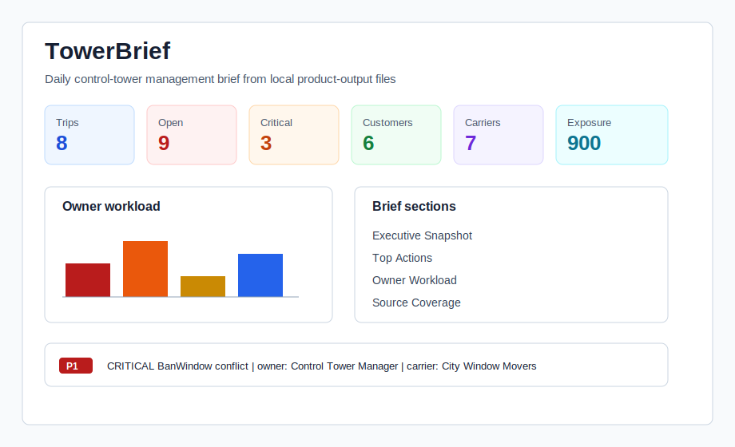

### Who It Is For

- Control tower managers
- Transport managers
- Dispatch leads
- Billing review teams
- Carrier-management teams preparing a daily standup

### Problem

Managers do not want to open 12 separate CSV files every morning. They need one brief that shows:

- which exceptions are critical;
- what needs action today;
- who owns each follow-up;
- which customers and carriers are exposed;
- where financial risk exists;
- which source files are missing or incomplete.

### Inputs

All files are optional and read from uploads or `tower_brief/demo_data/`:

- `trips.csv`
- `eta_risk_board.csv`
- `detention_report.csv`
- `gate_truth_report.csv`
- `fuel_exceptions.csv`
- `update_discipline_report.csv`
- `delay_classification_report.csv`
- `pod_aging_report.csv`
- `ban_risk_board.csv`
- `carrier_scorecard.csv`

### Outputs

- `tower_brief/output/daily_control_tower_brief.md`
- `tower_brief/output/daily_control_tower_brief.html`
- `tower_brief/output/daily_control_tower_brief.csv`

The CSV export is a unified action table with the exact `daily_control_tower_brief.csv` contract: brief date, section, priority, owner, source file/product, trip, vehicle, customer, carrier, exception type, risk bucket, severity, financial exposure, evidence, and suggested action.

Priority values are deterministic: `CRITICAL`, `HIGH`, `MEDIUM`, `LOW`, and `DATA GAP`. Owner buckets are operational roles such as `control_tower`, `billing_or_operations`, `fleet_audit`, `dispatcher_or_control_tower`, `documentation_or_billing`, `planning`, `transport_manager`, and `data_owner`.

### Run TowerBrief

```bash
uv sync
uv run streamlit run tower_brief/app.py
```

CLI:

```bash
uv run tower-brief tower_brief/demo_data tower_brief/output
```

### TowerBrief Limitations

- V1 is deterministic and file-based.
- It uses synthetic demo data only.
- It does not use AI-generated narrative, paid APIs, live integrations, emails, WhatsApp, Telegram, workflow engines, login systems, BI servers, or databases.
- Missing source files reduce brief coverage but do not block export generation.

## Python Libraries

- `pandas`: reads, normalizes, validates, groups, and exports operational tabular data.
- `openpyxl`: supports Excel workbook output for operations teams that still review in spreadsheets.
- `typer`: provides the command-line interface.
- `rich`: makes terminal output readable during demos and local runs.
- `loguru`: keeps lightweight operational logs.
- `pytest`: validates the core behavior.
- `ruff`: checks code quality before shipping.
- `streamlit`: runs the local product apps.
- `geopandas`: handles geospatial tables and coordinate reference systems.
- `shapely`: builds and checks geofence geometry.
- `geopy`: reverse-geocodes only geofence/event/exception locations when explicitly enabled.
- `folium`: renders the interactive map.
- `plotly`: renders clean KPI distribution charts.
- `pydantic`: validates product settings and input records.

## Public Story

This repo is the start of an open-source Transport Control Tower toolkit.

Day 1 is Trip Sheet Doctor: a CLI tool that turns messy trip sheets into an explainable exception pack.

Day 2 is GeoReplay: a Streamlit app that turns GPS pings and geofence masters into visit events and exceptions.

Day 3 is ETA Watch: a Streamlit app that turns trips and visit events into an ETA risk board.

Day 4 is DetentionClock: a Streamlit app that turns visit events and detention rules into chargeable detention review packs.

Day 5 is GateTruth: a Streamlit app that turns planned trips and GeoReplay visits into actual start and arrival evidence.

Day 6 is FuelGuard: a Streamlit app that turns fuel transactions, GPS points, fuel-site masters, and trip windows into a fuel reconciliation review pack.

Day 7 is UpdatePulse: a Streamlit app that turns trip plans, TMS or driver updates, and optional GeoReplay visits into an update-discipline review pack.

Day 13 is TowerBrief: a Streamlit app and CLI that turns product-output files into one daily control-tower management brief.

See [docs/shipping-log.md](docs/shipping-log.md) for the build log.

## Roadmap / Coming Soon

This open-source repo starts with local files because that is where most transport data problems begin. The next steps point toward integrated B2B control-tower workflows:

- Automated API integrations with TMS, GPS/telematics, fuel, and customer systems.
- Live Telegram/WhatsApp alerting for missed stops, long dwell, late trips, and high-risk exceptions.
- Planned vs actual route visualization for transport managers and customer-facing control towers.
- Fuel + GPS + trip reconciliation packs for Saudi/GCC fleet operations.
- Exception cockpit for daily standups, escalation ownership, and management reporting.
